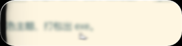

# glassgauge

Windows 桌面上的 **mirasim 用量挂件**，iOS 26 风格液态玻璃：玻璃透出的是窗口
后面**实时的真实内容**（不是壁纸贴图），带边缘位移折射。Tauri v2 + 原生
DirectX 渲染管线，常驻内存 ~40 MB。



## 它做什么

- 自动发现本机 mirasim relay（端口动态分配，扫描 + 响应形状认领），轮询
  `GET /v1/limits`；
- 常驻展开面板：5 小时 / 7 天 / 30 天三窗口卡，各含用量百分比、剩余、
  匀速线刻度、超前/落后、重置倒计时（只有百分比，不显示金额）；
- 自由拖动、双屏感知（含不同 DPI 缩放）、位置记忆、断线降级显示最后数据。

## 液态玻璃引擎

三种玻璃模式（`mode` 配置）：

| 模式 | 玻璃内容 | 说明 |
| --- | --- | --- |
| `refract`（默认） | 窗口后面的**实时画面** | DXGI 桌面复制抓帧（事件驱动+脏区过滤，静止零功耗）→ Direct2D 高斯模糊 → 位移贴图折射 → 饱和度 → 20px 圆角 AA → DirectComposition 垫在 WebView 内容后 |
| `wallpaper` | 壁纸按窗口物理位置裁剪折射 | refract 不可用时的自动兜底（锁屏/UAC/独占全屏/远程桌面），也可手动指定 |
| `live` | DWM 亚克力实时模糊 | 系统材质，圆角固定 ~8px |

**截图注意**：refract 模式下挂件必须从屏幕捕获中剔除（否则玻璃拍到自己形成
回环），因此**截图/录屏里看不到它**。要截它：托盘勾选"截图模式（玻璃暂用
壁纸）"，截完取消即回实时玻璃。

## 构建

```powershell
# 依赖：Rust (MSVC)、tauri-cli 2.x、WebView2 运行时（Win10 2004+ 自带）
cd src-tauri && cargo build          # 调试
tauri build                          # release + NSIS 安装包
cargo test                           # Rust 单测（几何/位移图/发现协议）
node --test ui/tests/*.test.js       # JS 单测（派生计算/裁剪映射/位移场）
```

## 网页仪表盘

挂件内建 **http://localhost:8642**（`webPort` 可改）：大数字显示各窗口**剩余
credits**（1 credit = $0.04 表列价，实测 1 限额单位 = 1 美分）、进度条、匀速线、
重置倒计时，30 秒自刷新。同时每次刷新都会探测 mirasim 尚未上线的
`/v1/credits` 端点，一旦其返回 200 页面自动改显官方账户真实余额。
只绑回环地址，随挂件开机自启。

## 凭证发现（authMode）

mirasim 2026-08 起 `/v1/limits` 需鉴权：token 每会话铸造、注入其 agent 进程
环境、不落盘。挂件按 `authMode` 取凭证：

- `auto`（默认）：读取同用户 mirasim-agent 进程的环境块，提取
  `ANTHROPIC_BASE_URL` / `ANTHROPIC_AUTH_TOKEN`（仅这两个变量）。同用户读进程
  环境是无需提权的标准操作；mirasim 不运行时自然取不到 → 显示未连接。
- `manual`：用配置的 `baseUrl` + `authToken`（会话轮换后需手动更新）。
- `none`：不取凭证（挂件仅作装饰）。

## 配置

`%APPDATA%\glassgauge\config.json`（首次运行自动生成），托盘"立即刷新"热载：

```jsonc
{
  "mode": "refract",          // refract | live | wallpaper
  "expand": "always",         // always 常驻展开 | hover 悬停展开
  "autostart": true,          // 开机自启（HKCU Run 键，随 exe 位置自动更新）
  "webPort": 8642,            // 网页仪表盘端口（http://localhost:8642）
  "authMode": "auto",        // 凭证来源：auto 进程环境 | manual（配 baseUrl+authToken）| none
  "accent": "auto",           // 主色：auto 壁纸取色（绕开绿）| blue | amber | ink | "#hex"
  "ink": "#000000",           // 可选：钉死字色（省略 = 随壁纸明暗自动黑/白字）
  "planLabel": "MAX",         // 徽章文字
  "validUntil": "2027-08-11", // 套餐到期（展示用）
  "refreshSeconds": 60,
  "alwaysOnTop": true,
  "glass": {
    "alpha": 0.03,            // 白纱浓度（0 = 纯玻璃）
    "blur": 4,                // 磨砂程度（0 = 全透，14 = 重磨砂）
    "displacement": 24,       // 边缘折射弯曲强度
    "band": 16,               // 折射边带宽
    "radiusCollapsed": 20,    // 玻璃圆角
    "saturate": 1.12
  }
}
```

## 设计文档

- [挂件整体设计](docs/design/2026-08-18-mirasim-usage-glass-widget-design.md)
- [原生实时折射引擎设计](docs/design/2026-08-18-glassgauge-native-refraction-engine-design.md)
- [引擎实施计划](docs/design/2026-08-18-glassgauge-refraction-engine-plan.md)

调试构建带验证入口：环境变量 `GG_SPIKE=b|a|cap|pipe`（层序/捕获剔除/抓取
通道/整条管线自检），`GG_DUMP_ONCE=1`（启动 2.5s 后自动导出玻璃帧 PNG），
托盘"导出玻璃帧"。

## 许可

MIT，见 [LICENSE](LICENSE)。

## 已知边界

- 鼠标指针不会映在玻璃里（捕获不含指针，iOS 同）；
- DRM 保护的视频区域在玻璃里是黑的；
- 需要 Windows 10 2004+（捕获剔除 API），更早系统自动落到壁纸模式。
